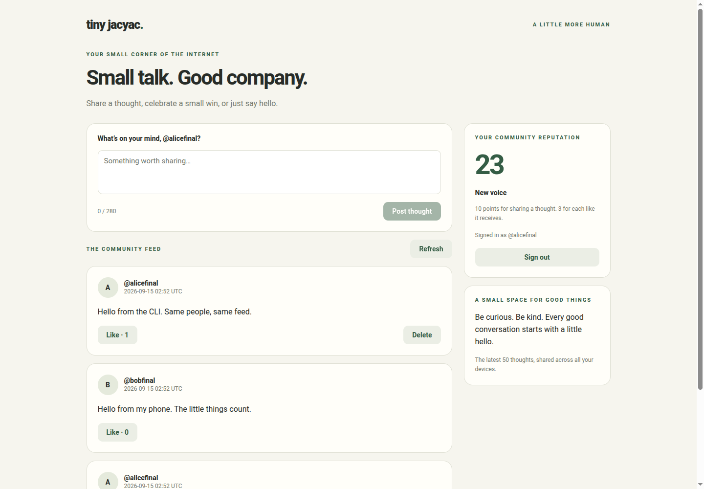
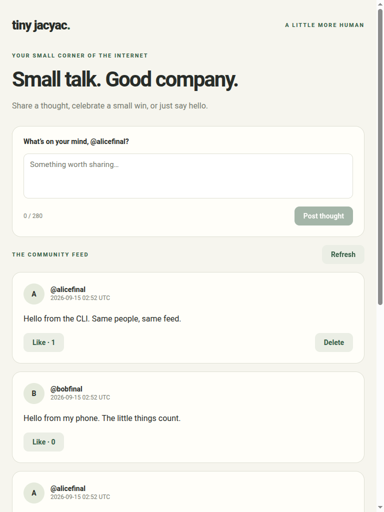
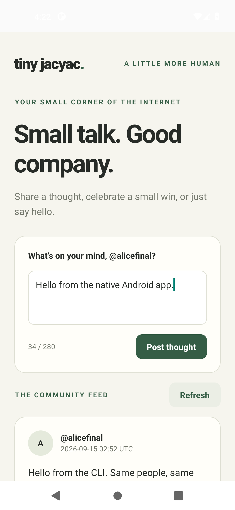
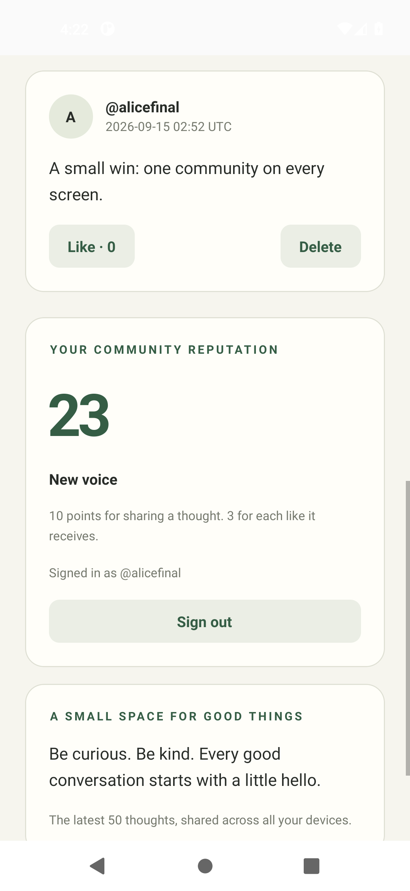
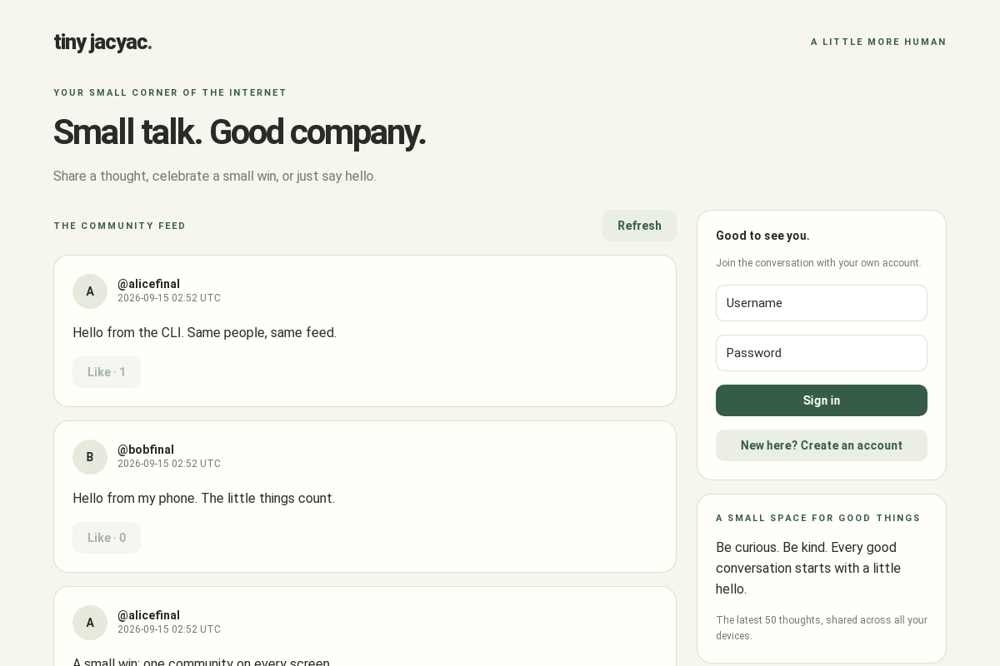
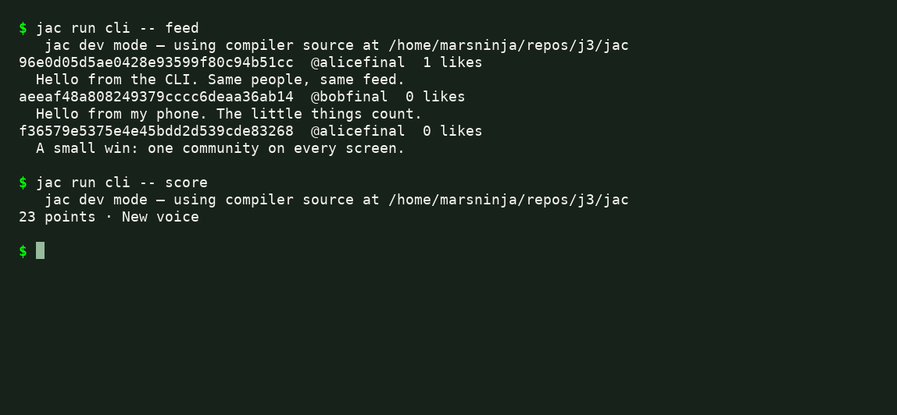

# Tiny JacYac

A small social app in fewer than 1,000 physical lines of Jac and `jac.toml`,
including tests, blank lines, and styles. Six apps share one product:
web, React Native mobile, native desktop host, CLI, feed service, scoring service.
The shared mobUI screen supports registration, sign-in, posting, likes, deletion,
and reputation. Posts persist on the shared graph; only their authors can delete them.

## Screenshots

One community across four clients. These captures show the running app with
sample posts shared between the web, mobile, desktop, and CLI clients.

### Web · desktop browser

The two-column layout at **1440 × 1000**, with the composer, feed, and reputation.



### Web · tablet browser

The same web client adapts to a single column at **768 × 1024**.



### Mobile · native Android

The **React Native Android app**, captured directly from a Pixel 5 emulator
running Android 11 at **1080 × 2340**. These captures use the debug APK with
Metro and the shared backend. The two views show composing a post, then the
feed and reputation.

| Compose | Feed and reputation |
| --- | --- |
|  |  |

### Native desktop · Linux

The packaged **1200 × 800** WebKitGTK window, showing the shared feed and sign-in.



### CLI · terminal

The CLI reads the same posts and reputation from the two services.



## How it fits

The three graphical clients import one responsive mobUI component. The CLI uses
the same typed feed API; the feed calls the stateless scoring service. Jac supplies
authentication, graph persistence, transport, and generated platform packaging.
The four client entry points are `web.jac`, `mobile.jac`, `desktop.jac`, and
`cli.jac` at the project root; shared code and the two services live in `core/`.

| Authored files | Physical lines |
| --- | ---: |
| Shared UI and styles | 536 |
| Feed and scoring services | 170 |
| CLI | 116 |
| Web, mobile, desktop entry points | 17 |
| Tests | 66 |
| `jac.toml` | 50 |
| **Total** | **955** |

Reproduce the count with `wc -l jac.toml *.jac core/*.jac`.
Documentation, dependencies, compiler/runtime code, and generated platform files
are outside this application-source count. The example requires the compiler
routing fix in the local `j3` checkout, which preserves service routes for inline
client RPC calls, including aliased imports. That compiler fix lives in `j3`,
outside this project repository.
The desktop entry includes an empty `with entry` block so the packaged host has
the bootstrap artifact expected by the current desktop runtime.
The desktop generator in that checkout also needs explicitly typed port values
so the native host includes the port number in its navigation URL.
The native Android captures additionally use a local Jac runtime fix that
exports `useJacState` and `jacSetToken`; both are required to render the shared
screen and sign in. That runtime fix is not yet published.

## Run

The development layout is `~/repos/j3/_planning/tiny_jacyac`. The `[dev]` section
in `jac.toml` selects `../../jac`, the compiler source in the surrounding `j3`
checkout. From this project directory:

```bash
jac install
jac run --serve --fleet web
```

Open http://localhost:8000. Create an account in the UI. Use `--fleet` for this
example: it runs the two services in separate processes and mounts their
authentication endpoints behind the web gateway.
Accounts live in the feed service, using its built-in `/api/feed/user/*` endpoints.
Scoring is stateless: 10 points per post plus 3 per received like.
If scoring is unavailable, the feed remains usable and labels the missing score.

## Other clients

```bash
jac run cli -- login alice       # prompts for the password
jac run cli -- post "Hello from my terminal"
jac run cli -- feed              # prints post IDs for like/delete
jac run cli -- score
jac run cli -- logout
jac run desktop
jac run --dev mobile
```

The CLI stores a token in `~/.tiny-jacyac.json` with owner-only permissions.
`TINY_JACYAC_SESSION` selects another session file. `TINY_JACYAC_URL` selects
the backend for CLI and desktop; CLI also accepts `--url` before its command.
Mobile asks for a server address: use your computer's LAN address on a phone,
or `http://10.0.2.2:8000` in the Android emulator during development.
The packaged Android release uses Android's default network policy and needs an
HTTPS backend; its JavaScript is embedded, so it does not need Metro.
Start the web fleet first.
All clients connect to the same feed, accounts, and scores.

```bash
jac build web
jac build desktop
jac build --platform web mobile       # browser preview of the mobile entry
jac build --platform android mobile   # Android APK; provisions native tooling
jac build --platform ios mobile       # requires macOS and Xcode
```

Desktop uses an OS webview in a compiled native host. The feed and scoring
services execute on the server. No standalone LLVM scoring executable is included.
For another checkout location, update `[dev].jaclang_source` to your Jac source
directory, or remove `[dev]` and use a compatible Jac binary with workspace
support and the compiler fixes described above.

## Validate

```bash
jac check --nowarn
JAC_TEST_JOBS=0 jac test
jac fmt . --check
jac browse open http://localhost:8000
jac browse snapshot
jac browse fill '[aria-label="Username"]' alice
jac browse fill '[aria-label="Password"]' your-password
jac browse click '[aria-label="Sign in"]'
jac browse console
```

The tests cover account impersonation, unauthorized writes/deletion, post length,
like/unlike, scoring thresholds, and the line limit. Build output, dependency
trees, local credentials, and screenshots under `.jac/` are generated artifacts.
